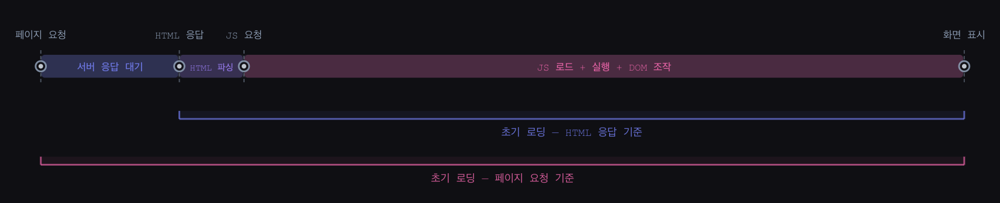
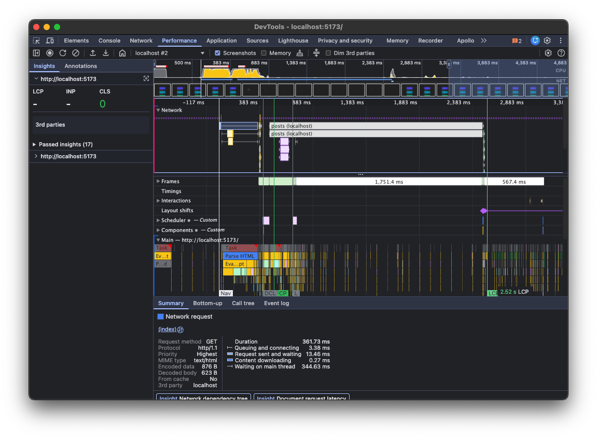
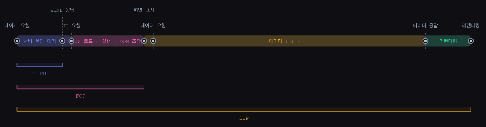
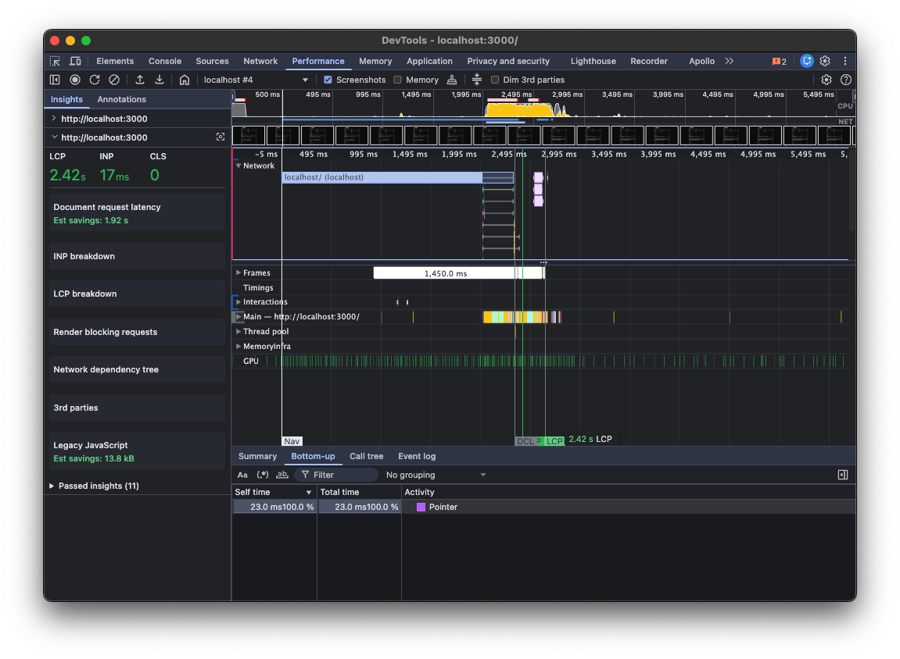
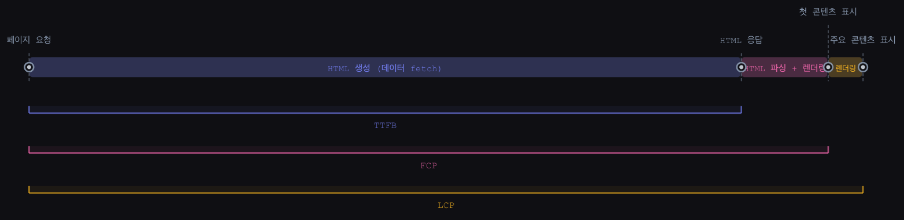

# CSR vs SSR 속도 비교 (feat. Web Vitals)

## Introduction

CSR의 단점을 설명할 때 빠지지 않는 내용이 있습니다.

> "CSR은 초기 로딩 속도가 느리다."

그런데 좀 더 생각해보면 한가지 의문이 생깁니다.

> "SSR도 서버에서 데이터를 fetch하면 그동안 화면이 비는 거 아닌가? 그러면 SSR이 CSR에 비해 느릴 수도 있지 있을까?"

이렇게 헷갈리는 이유는 속도가 상대적인 개념이기 때문입니다. 무엇을 기준으로, 어느 시점부터 측정하느냐에 따라 설명이 달라질 수 있습니다.

이 글에서는 CSR과 SSR의 속도를 비교해 명확히 설명할 수 있도록 TTFB, FCP, LCP 지표를 기준으로 알아봅니다.

---

## CSR과 SSR이란?

### CSR (Client-Side Rendering)

브라우저(클라이언트)에서 JavaScript를 실행해 화면을 그리는 방식입니다.

서버는 내용이 거의 없는 최소한의 HTML과 JS 파일 링크만 응답합니다. 브라우저가 HTML을 받은 뒤 JS를 요청하고, JS 엔진이 실행되고, React 같은 라이브러리가 DOM을 조작해 콘텐츠가 화면에 표시됩니다.

HTML을 받은 이후부터 콘텐츠가 보이기까지 필요한 절차가 많은 만큼 흰 화면이나 로딩 UI가 표시됩니다.

<figure>
    
    <figcaption><a href="https://prismic.io/blog/client-side-vs-server-side-rendering#what-is-clientside-rendering">https://prismic.io/blog/client-side-vs-server-side-rendering#what-is-clientside-rendering</a></figcaption>
</figure>

### SSR (Server-Side Rendering)

서버에서 HTML을 미리 완성해 브라우저에 전달하는 방식입니다.

서버에서 렌더링한다는 것은 시각적으로 그린다는 게 아니라, 필요한 데이터를 포함한 완성된 HTML 문자열을 만들어 보낸다는 것을 의미합니다.

브라우저는 받은 HTML을 파싱해 로딩없이 바로 콘텐츠를 표시할 수 있습니다.

<figure>
    
    <figcaption><a href="https://prismic.io/blog/client-side-vs-server-side-rendering#what-is-serverside-rendering">https://prismic.io/blog/client-side-vs-server-side-rendering#what-is-serverside-rendering</a></figcaption>
</figure>

---

## "CSR이 느리다"는 말이 헷갈리는 이유

SSR 방식은 완성된 HTML을 응답하는 정적 SSR과 요청한 시점에 HTML을 생성해 응답하는 동적 SSR으로 나눌 수 있습니다.

동적 SSR의 경우 외부 API를 호출하거나 DB 쿼리가 느리면, 데이터를 받아 HTML을 생성하기까지 전체 페이지 로드가 지연되게 됩니다.

반면 CSR은 서버가 빈 HTML을 응답하고 JS가 실행된 후 브라우저에서 데이터를 불러오기 때문에, 데이터가 느리게 오더라도 그 사이에 로딩 UI를 보여줄 수 있습니다.

**그렇다면 CSR이 SSR보다 빠른 걸까요?**

결론부터 말하면 기준에 따라 달라집니다.

- 초기 로딩을 HTML 응답 ~ 화면 표시 시점으로 보면, JS 처리 시간이 소요되기 때문에 CSR이 SSR에 비해 느리다고 할 수 있습니다.
    - 일반적으로 말하는 초기 로딩이 이 구간에 해당한다고 볼 수 있습니다.
- 초기 로딩을 페이지 요청 ~ 화면 표시 시점으로 보면, 서버 데이터 fetch 작업이 CSR의 JS 처리 시간보다 길어지게 될 경우 SSR이 CSR에 비해 느릴 수 있습니다.

---

## TTFB / FCP / LCP로 보는 CSR vs SSR

### 웹 바이탈 지표

웹 바이탈 지표는 웹의 품질을 수치화하고 개선하는데 참고할 수 있는 지표입니다.
렌더링 방식의 속도를 비교할 때 이러한 지표로 보면 더욱 명확해집니다.
이 글에서는 시간과 관련된 세가지 지표를 보겠습니다.

- **TTFB (Time to First Byte)**: 페이지를 요청한 시점부터 서버 응답의 첫 번째 바이트를 받는 시점까지의 시간
<figure>
    
    <figcaption>
        startTime와 responseStart 사이의 시간입니다.
        <a href="https://web.dev/articles/ttfb?hl=ko">https://web.dev/articles/ttfb?hl=ko</a>
    </figcaption>
</figure>

- **FCP (First Contentful Paint)**: 페이지를 요청한 시점부터 콘텐츠의 일부가 화면에 처음 표시되는 시점까지의 시간
<figure>
    
    <figcaption>
        <a href="https://web.dev/articles/fcp?hl=ko">https://web.dev/articles/fcp?hl=ko</a>
    </figcaption>
</figure>

- **LCP (Largest Contentful Paint)**: 페이지를 요청한 시점부터 주요 콘텐츠(가장 큰 이미지나 텍스트 블록)가 화면에 표시되는 시점까지의 시간
<figure>
    
    <figcaption>
        <a href="https://web.dev/articles/lcp?hl=ko">https://web.dev/articles/lcp?hl=ko</a>
    </figcaption>
</figure>

### CSR과 SSR 지표 비교

#### 실험 설계

이 글의 측정 결과는 아래 조건의 데모 앱을 기반으로 합니다. ([소스코드](https://github.com/o5sy/blog/tree/main/web/csr_vs_ssr/demo))

| 구분 | 스택 |
|---|---|
| CSR | React 19 + Vite |
| SSR | Next.js 16 App Router (dynamic SSR) |
| API 서버 | Express, `GET /api/posts?delay=` |

두 앱 모두 같은 API 서버를 바라보며, `delay` 쿼리 파라미터로 응답 지연 시간을 조절할 수 있습니다. 렌더링 방식별 차이를 명확히 드러내기 위해 2000ms의 지연을 의도적으로 설정했습니다.

#### CSR

| 지표 | 시간 | 설명 |
|---|---|---|
| TTFB | 13ms | 빈 HTML을 즉시 반환하므로 매우 빠릅니다. |
| FCP | 516ms | HTML 수신 → JS 요청 → JS 실행 → DOM 조작 순서를 거쳐야 첫 콘텐츠가 표시됩니다. JS 번들이 커질수록 길어질 수 있습니다. |
| LCP | 2.52s | JS 실행 이후 API를 호출하기 때문에, API 지연(2000ms)이 그대로 반영됩니다. |

TTFB가 매우 빠르고, FCP는 JS 처리 시간만큼, LCP는 API 지연까지 더해져 느려집니다.

일반적으로 LCP의 체감 시간을 줄이기 위해 로딩 UI(스켈레톤, 스피너 등)를 표시합니다.

#### SSR

| 지표 | 시간 | 설명 |
|---|---|---|
| TTFB | 2.02s | 정적 SSR에선 빠르지만, 동적 SSR에서 데이터 fetch 등 작업이 많을수록 느려질 수 있습니다. |
| FCP | 2.42s | HTML을 받으면 바로 콘텐츠를 표시할 수 있어, TTFB 직후 빠르게 렌더링됩니다. |
| LCP | 2.42s | 주요 콘텐츠가 이미 HTML에 포함되어 있어 FCP와 거의 동시에 표시됩니다. |

FCP와 LCP가 빠른 대신 TTFB가 서버 처리 속도에 영향을 받아 느려질 수 있습니다.

### 기준에 따른 비교 설명

- TTFB 기준: 크게 차이 안나지만, 동적 SSR은 서버 작업이 길어질 경우 CSR보다 느려질 수 있습니다.
- FCP 기준: 일반적으로 SSR이 빠르다. 단, SSR의 TTFB가 CSR의 JS 처리 시간보다 길면 역전될 수 있습니다.
- LCP 기준: 일반적으로 SSR이 빠르다. CSR에서 주요 콘텐츠가 초기 렌더링에 포함되지 않는다면 워터폴로 인해 늦어질 수 있습니다.

---

## 마무리

이제 렌더링 방식의 속도를 기준점에 따라 명확하게 설명할 수 있게 됐습니다.

"CSR이 초기 로딩이 느리다"는 것도 HTML 응답부터 첫 콘텐츠 렌더링에 걸린 시간(FCP에서 TTFB를 뺀 시간)으로 보면 그렇다고 할 수 있습니다. 돌아보면 이 말이 드러내고자 했던 건 CSR에 JS 처리 과정이 있다는 점이라고 생각됩니다. 충분한 맥락과 기준점 없이 쓰이다 보니 헷갈리는 요소가 된 것입니다.

"CSR은 초기 로딩 느림, SSR은 빠름"으로만 기억한다면 초기 로딩이 느릴 때 렌더링 방식을 바꾸는 것만을 떠올리게 됩니다. 하지만 세부 맥락을 이해하면 원인을 좁혀 다양한 최적화 방안을 고려할 수 있습니다.

TTFB가 느리다면 CDN과 캐싱 전략을, FCP가 느리다면 코드 스플리팅과 번들 사이즈 최적화 등을 검토할 수 있습니다.

이처럼 일반적인 사실을 그대로 받아들이기보다 숨겨진 맥락을 파악하는 게 중요합니다. 그래야 문제가 생겼을 때 적합한 선택지를 고를 수 있기 때문입니다.

---

> 참고
> - [Client-side vs. Server-side Rendering](https://prismic.io/blog/client-side-vs-server-side-rendering)

> - [SSR로 사용자 경험 향상시키기](https://lurgi.github.io/Development/Enhancing-UX-with-SSR)
> - [리액트의 렌더링 전략](https://hwanheejung.tistory.com/67)

> - [Web Vitals — web.dev](https://web.dev/vitals?hl=ko)
> - [Time to First Byte (TTFB)](https://web.dev/articles/ttfb?hl=ko)
> - [First Contentful Paint (FCP)](https://web.dev/articles/fcp?hl=ko)
> - [Largest Contentful Paint (LCP)](https://web.dev/articles/lcp?hl=ko)

> - [Understanding Next.js Data Fetching (CSR, SSR, SSG, ISR)](https://theodorusclarence.com/blog/nextjs-fetch-method)
> - [How to choose between Next.js CSR, SSR, SSG, and ISR](https://theodorusclarence.com/blog/nextjs-fetch-usecase#introduction)